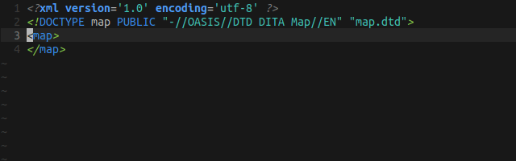
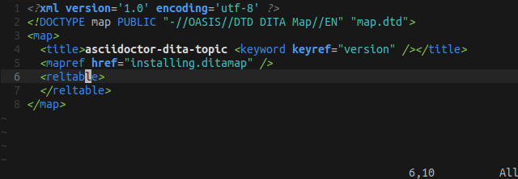

[#top]
= vim-dita

[#description]
== Description

The *vim-dita* plug-in adds support for Darwin Information Typing Architecture (DITA) version 1.3 to Vim. It provides file type detection for DITA files, as well as syntax highlighting and omni completion for DITA maps and topics according to the official link:http://docs.oasis-open.org/dita/dita/v1.3/dita-v1.3-part3-all-inclusive.html[specification].

[#features]
== Features

[#doctypes]
=== Supported document types

The following are currently supported DITA document types and their corresponding `filetype` settings in Vim.

[cols="1,1,1"]
|===
|DITA document type |Expected file extension |Vim `filetype` setting

|Map
|`.ditamap`
|`ditamap` †

|Bookmap
|`.ditamap`
|`ditabookmap`

|Topic
|`.dita`
|`ditatopic` †

|Concept
|`.dita`
|`ditaconcept`

|Task
|`.dita`
|`ditatask`

|Reference
|`.dita`
|`ditareference`

|Glossary
|`.dita`
|`ditaglossary`

|DITAVAL
|`.ditaval`
|`ditaval`
|===

File type settings marked with the dagger symbol *†* are used by default for the selected file extension if the `DOCTYPE` directive can not be found on the first three lines of the file. To switch to a different file type manually, use the following Vim command:

[literal,subs="+quotes"]
....
**:set ft=__file_type__**
....

[#highlighting]
=== Syntax highlighting

The plug-in provides syntax highlighting for each xref:doctypes[document type] separately to ensure that otherwise valid DITA elements are not highlighted for document types that do not allow them.

Note that the plug-in only checks that the element is allowed in the particular document type, not whether it is used in the correct place. The visual distinction between valid and invalid elements also depends on the color scheme you use.

[#completion]
=== Omni completion

The plug-in provides contextual completion based on the DITA specification. When completing an element name, it allows you to cycle through elements that are valid children of the element your are in, when completing attribute names, it only offers attributes that are valid for that specific element, and if attribute values are limited to a list of possible values, it only offers you those values.

Note that the plug-in only checks whether the element is a valid child of its parent, not whether it is used in the right order or the correct number of times.

By default, the key combination for omni completion is set to `Ctrl+x Ctrl+o`. To cycle through the list of available options forwards, press `Ctrl+n`, to cycle through the list backwords, press `Ctrl+p`.

[#copyright]
== Copyright

Copyright © 2024 Jaromir Hradilek

This program is free software; see the source for copying conditions. It is distributed in the hope that it will be useful, but WITHOUT ANY WARRANTY; without even the implied warranty of MERCHANTABILITY or FITNESS FOR A PARTICULAR PURPOSE.
